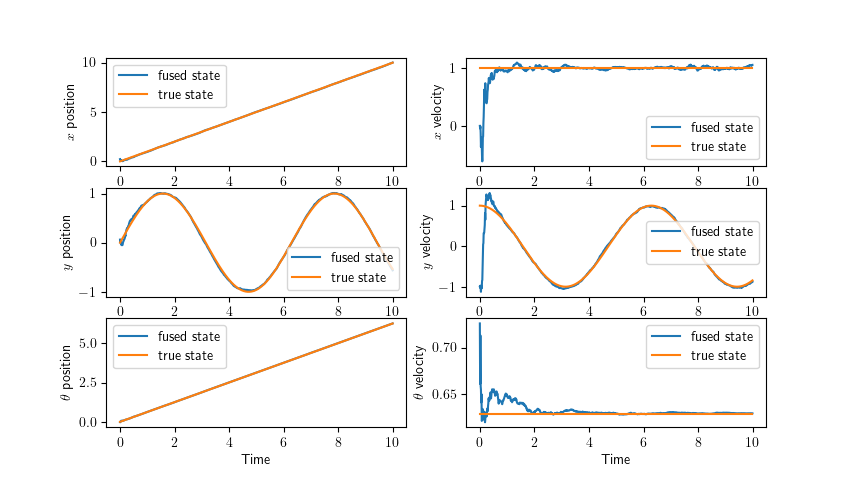

Testing scripts for the Kalman filter part of the localisation subsystem.

The goal of this component is to fuse IMU data with pose estimates from the camera vision system.

The data expected is:
- IMU
    - Acceleration in robot body frame, including gravity
    - Rotational velocity
- Camera system
    - Pose estimate (x,y,z,r,p,y) in world frame

# Description of Scripts

## `pose_estimation_IMU_pose.py`

Simulates an EKF tracking a sinusoidal path in a 2D plane. The degrees of freedom are $x,y,\theta$. It uses a constant acceleration motion model, assuming linear acceleration is measured in the predict step, and that in the update step, x,y, and angular position are measured, along with angular velocity.

Look! Pretty graph!

## To do

1. Implement independent prediction/update steps so that data can be received at different rates from IMU vs Camera sensors
2. Model sensor uncertainty using actual data from the sensors
3. Implement using C library
